## <samp>Oie, Eu me chamo</samp> [Guilherme Palma](https://www.linkedin.com/in/guilherme-peres-lins-da-palma) :smiley:👋

<h4 align="center" id="home">
   <samp>:star2: Tecnolo em Desenvolvimento de Software Multiplataformas - :closed_book: <b>FATEC Osasco</b> :star2:</samp>
</h4>

   
<samp id="home_menu">&#9776; Um pouco sobre mim 💬</samp>

   <h4>Eu me chamo Guilherme Palma, Tenho 17 anos e sou Desenvolvedor de Software.</h4>
   
Sou Apaixonado pelo Desenvolvimento de APPs Mobile, mas também me aventuro no Desenvolvimento Web :laughing:

   

   

      :page_with_curl: Acesse meu <a target="_blank" href="curriculos\CURRICULO_GUILHERME_PALMA_MOBILE.pdf">Currículo</a> ou <a target="_blank" href="Projects.md">Veja meus Projetos</a>
       
      <a href="https://github.com/GuilhermePalma/GuilhermePalma/blob/main/English_README.md">English Version Here</a> or
         <a href="https://github.com/GuilhermePalma/GuilhermePalma/blob/main/Français_README.md">Version Française Ici</a>
   

- **Linguagens e Frameworks**
     
    
    
    
    
    
    
    
    
    
    

- **Ferramentas de Desenvolvimento (IDEs e Editores de Codigo)**
     
    
    
    
    

- **Outros Softwares**
     
    
    
    
    
    
    
    
    
    

 

   <h5>Entre em Contato :smile:<h5/>

   
   
   
   

## :computer: Linguagens e Estatística

 

   

   

   

    
    
    

   
   &nbsp;&nbsp;&nbsp;&nbsp;&nbsp;&nbsp;&nbsp;&nbsp;&nbsp;&nbsp;&nbsp;&nbsp;&nbsp;
   
   &nbsp;&nbsp;&nbsp;&nbsp;&nbsp;&nbsp;&nbsp;&nbsp;&nbsp;&nbsp;&nbsp;&nbsp;&nbsp;
   
   &nbsp;&nbsp;&nbsp;&nbsp;&nbsp;&nbsp;&nbsp;&nbsp;&nbsp;&nbsp;&nbsp;&nbsp;&nbsp;
   
   &nbsp;&nbsp;&nbsp;&nbsp;&nbsp;&nbsp;&nbsp;&nbsp;&nbsp;&nbsp;&nbsp;&nbsp;&nbsp;
   
   &nbsp;&nbsp;&nbsp;&nbsp;&nbsp;&nbsp;&nbsp;&nbsp;&nbsp;&nbsp;&nbsp;&nbsp;&nbsp;
   
   &nbsp;&nbsp;&nbsp;&nbsp;&nbsp;&nbsp;&nbsp;&nbsp;&nbsp;&nbsp;&nbsp;&nbsp;&nbsp;
   
   &nbsp;&nbsp;&nbsp;&nbsp;&nbsp;&nbsp;&nbsp;&nbsp;&nbsp;&nbsp;&nbsp;&nbsp;&nbsp;
   

